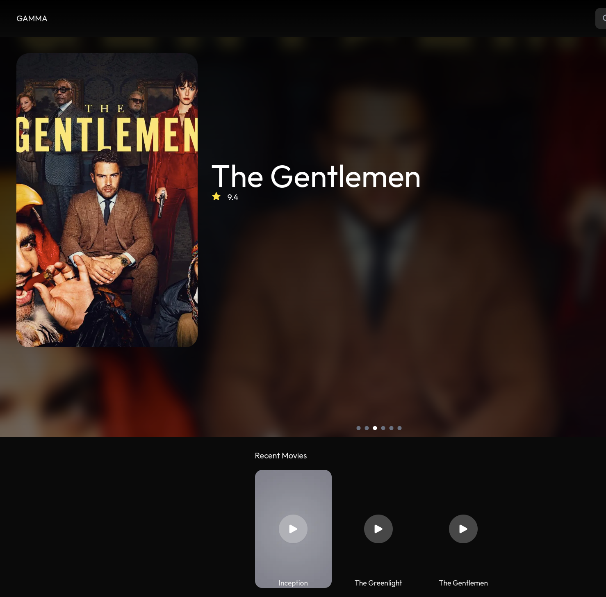
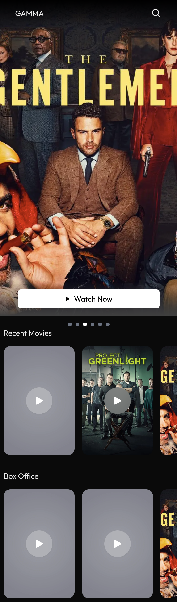

This is a [Next.js](https://nextjs.org) project bootstrapped with [`create-next-app`](https://nextjs.org/docs/app/api-reference/cli/create-next-app).

## Demo

 Live Demo:[https://gama-iota.vercel.app/](https://gama-iota.vercel.app/)

## Screenshots



## Prerequisites

Before you begin, ensure you have met the following requirements:

- Node.js 18.17 or higher
- NPM installed

## Installation
Follow these steps to get your environment set up:

To run in Development mode


1. Clone the repo
   ```sh
   git clone https://github.com/SameC137/gama.git
   ```
2. Navigate terminal to the cloned repo
3. Install NPM packages
   ```sh
   npm install
   ```
4. Run Development server
   ```sh
   npm run dev
5. Open [http://localhost:3000](http://localhost:3000) with your browser to see the result.
   
To run in production mode: continued from step 3 above

4. Build the project using 
    ```sh
        npm run build
    ```
5. Then if the build completes successfully run it using
    ```sh
       npm run start
    ```


## Performance Optimization Techniques

Project utilizes ssr to preload the data for the requests and passes it to the swr provider. This allows for the best of both worlds in that the data is prefetched but has the ability to be refreshed on the client side due to staleness. The SWR library provides strong caching capabilities. SWR is a strategy to first return the data from cache (stale), then send the fetch request (revalidate), and finally come with the up-to-date data. 

## API Integration
API endpoints
- https://gama-test-1.onrender.com/box-office-movies
    - Expected response when status 200 is an array of movies in format

        ```
        [{
            Title: string;
            video_url: string;
            cover_img_url: string;
            rating: number;
            },...]
        ```
- https://gama-test-1.onrender.com/recent-movies
     - Expected response when status 200 is a json array of movies in format

        ```
        [{
            Title: string;
            video_url: string;
            cover_img_url: string;
            rating: number;
            },...]
        ```
-  https://gama-test-1.onrender.com/filter-movie- used with a query parameter name that represents the movie name with the final url looking like https://gama-test-1.onrender.com/filter-movie/filter-movie?name=movie_name
        
    - Expected response when response is a json  array of movies in format

        ```
        [{
            Title: string;
            video_url: string;
            cover_img_url: string;
            rating: number;
            },...]
        ```

    - Expected Response when status 404
      ```
        {
            message:string
        }
        ```
The playground for the api endpoints can be found here https://gama-test-1.onrender.com/api-docs/

## Error Handling Strategy
1. Axios Interceptor

    There is  an Axios interceptor to catch global errors that occur during API requests. This is used to convert all the errors into the same format that allows us to handle the errors easier in upstream components. In the presence of log tracking services this can be used to push all the errors to the services as required. 

2. Error Boundaries

    Utilizing an Error Boundary component to catch errors within specific parts of the application, which can be used to display a more user friendly error message and allows a reset attempt. Major components such at the movie lists and carousel are wrapped in this error boundary. This component can also be used to send tracking logs to centralized services. This is especially useful to detect crashes and receive a stacktrace.

3. error.js File

    Created a dedicated error.tsx file within the relevant route folders.
    This file will be rendered by Next.js when an uncaught error occurs during server-side rendering (SSR) or client-side rendering (CSR).

4. Create a Custom Image Component

    Created a reusable component ImageWithFallback that handles image loading and fallback scenarios.

5. Add error handling to video player

    Created a reusable video player that shows a user friendly error message when video playback has error.


### Folder Structure
```md
├── next.config.js
├── next-env.d.ts
├── package.json
├── package-lock.json
├── postcss.config.mjs
├── public
│   └── fallback.jpg
├── README.md
├── src
│   ├── app
│   │   ├── error.tsx
│   │   ├── favicon.ico
│   │   ├── globals.css
│   │   ├── layout.tsx
│   │   ├── loading.tsx
│   │   ├── page.tsx
│   │   └── types
│   │       └── index.ts
│   ├── components
│   │   ├── blured_button.tsx
│   │   ├── carousel.tsx
│   │   ├── error_boundary.tsx
│   │   ├── header.tsx
│   │   ├── image.tsx
│   │   ├── movie_card.tsx
│   │   ├── movie_list.tsx
│   │   ├── search_screen.tsx
│   │   ├── skeletons.tsx
│   │   ├── skeleton.tsx
│   │   ├── swr_provider.tsx
│   │   └── video_player.tsx
│   └── utils
│       └── requests.ts
├── tailwind.config.ts
└── tsconfig.json
```
Description for some of the files:

- src: Source code for the Next.js application.

    - app: 
        - error.tsx: Component for handling application errors.
        - globals.css: Global CSS styles applied throughout the application.
        - layout.tsx: Layout component defining the overall page structure with the header up top.
        - loading.tsx: Component displayed while content is loading.
        - page.tsx: Home page for app.
        - types: Folder for reusable type definitions .
            - index.ts: Type definitions .
        - components:  UI components.
            - blured_button.tsx: Component for a button with a blurred effect.
            - carousel.tsx: Component for box office movie listing in a carousel format.
            - error_boundary.tsx: Component to catch and handle errors 
            - header.tsx: Component for the website header that contains the name and search.
            - image.tsx: Component for displaying images with fallback.
            - movie_card.tsx: Component for a movie card with details.
            - movie_list.tsx: Component rendering a list of movies using the movie_card component.
            - search_screen.tsx: Component for the movie search functionality used in header component.
            -  skeleton.tsx: Component that is going to be used in building out skeletons that have a shimmer effect.
            - skeletons.tsx: Skeleton components representing different components.
            - swr_provider.tsx: Component for providing SWR (React library for data fetching) context.
            - video_player.tsx: Custom component for playing videos.
        - utils: Project-specific utility functions.
            - requests.ts: Functions for making API requests and the main axios instance.